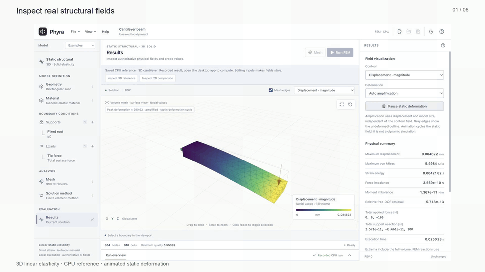

<p></p>

**Prepare a physical problem. Solve locally. Understand the result.**

Phyra is an open-source engineering analysis desktop workbench combining classical finite element analysis with experimental Physics ML. The **0.1.0 development line** supports linear static elasticity, with a professional light/dark workspace, contextual engineering help and real FEM/PINN comparison.

[](assets/media/phyra-introduction.mp4)

**[Watch the product walkthrough](assets/media/phyra-introduction.mp4)** · [Explore the roadmap](roadmap.md) · [Run an example](examples)

The video records the previous interface iteration using actual CPU reference studies. The screenshots below show the current interface inspecting saved CPU fields. Product refinement is continuing; final video recapture is deferred. Computing a new solution requires the desktop app.

## What you can do today

- **Prepare and solve:** edit box, cylinder and connected bracket primitives or a 2D rectangle; assign material, component supports, total force and inward pressure; generate a mesh and run classical FEM.
- **Train from physics:** solve rectangular plane-stress elasticity with a real PyTorch PINN, using equilibrium and boundary conditions without FEM training labels. Inspect training settings, live PDE/boundary losses, device and precision.
- **Compare and inspect:** switch FEM, PINN, absolute and relative differences; probe authoritative values; inspect stress/displacement, reactions and force/moment balance, with scientific color scales and actual or amplified deformation.
- **Understand the method:** open offline Workbench help or contextual screen help for workflow, assumptions, physical conditions, mesh quality, interpretation and limitations.
- **Keep ownership:** local isolated workers, cancellation, stale-result detection, versioned `.phyra` save/reopen, definition-only recovery copies and SI CSV exports. Analysis needs no account, API key or network service.


Current interface · saved CPU 3D FEM reference · amplified static deformation.


Current interface · saved CPU FEM/PINN comparison · recorded measurements, not live training.

## Run locally

Install Node **22.12+**, Python **3.12** and Rust **1.94** with rustfmt/clippy. macOS needs Xcode command-line tools; Windows needs Visual Studio C++ Build Tools, Windows SDK and WebView2. Supported launch targets are macOS Apple Silicon, minimum macOS 14, and Windows x64.

```sh
npm ci
npm run setup
npm run package:engine
npm run dev
```

`setup` preserves an existing `.venv`, prefers official Python on macOS and installs CPU Torch on Windows. Workers start automatically. [CONTRIBUTING.md](CONTRIBUTING.md) contains verification and packaging commands.

For a browser preview after `npm ci`, run `npm run dev:web` and open the local URL. **Inspect 3D reference** and **Inspect 2D comparison** load real saved CPU results, including fields, recorded training history and measured comparison. Changes to physical inputs make those results stale.

For a first desktop study, choose **3D cantilever beam**, review Geometry → Material → Supports/Loads → Mesh → Solver, and run FEM. For Physics ML, choose **2D plane-stress tension**, inspect thickness and supports, then use **Compare FEM / PINN**. Choose **Help** or press **F1** for the current screen’s offline guide.

## Scientific scope

The implemented physics is homogeneous, isotropic, small-strain **linear static elasticity**. 3D uses first-order tetrahedra; rectangular 2D plane stress uses constant-strain triangles and explicit physical thickness. Internal geometry, properties and exports use SI; display-unit changes do not modify the model.

The PINN is **experimental**. Comparison evaluates displacement at the same nodes and stress at the same cell centroids as FEM, reporting unweighted relative L2, maximum absolute differences and measured timings. Undefined zero-reference relative values are explicitly omitted. New runs also measure normalized residuals at independently sampled points after training; those diagnostics are not field-error bounds. Low training loss alone does not establish accuracy or equilibrium; use independent references, balance and mesh convergence.

Idealized corners/restraints may produce stress singularities, and first-order tetrahedra can be stiff in bending. Poisson ratios above 0.45 are rejected. Deformation playback scales a static field; it is not dynamics. Projects retain settings, seeds, metrics, fields and provenance, but do not resume trained weights. Version 1 archives migrate with an explicit old-cache discard notice.

Desktop recovery preserves valid project definitions after an editing pause; invalid numeric drafts pause recovery. Restoring creates an unsaved project without cached fields or trained weights. Recompute and save it explicitly; recovery does not overwrite the original project file.

General CAD import, assemblies, multiple materials, anisotropy/composites/graded and nonlinear materials, contact, transient physics, thermal/flow solvers, reusable learned models and an AI assistant are future work. The [roadmap](roadmap.md) sets their dependencies and scientific acceptance gates, including optional framework adapters and a future CPU/Apple/NVIDIA/distributed execution runtime. No external Physics ML framework or distributed runtime is integrated today.

## Learn the implemented method

Start with **2D plane-stress tension**: review units and restraints, run FEM, then run **Compare FEM / PINN**. Inspect field differences, reactions and balance alongside training losses. The offline **Physics ML learning path** explains the steps and links the primary references.

The current PINN uses a neural displacement field and automatic differentiation to evaluate equilibrium and boundary residuals, adapted from [Raissi, Perdikaris and Karniadakis (2019)](https://doi.org/10.1016/j.jcp.2018.10.045). It learns one problem without FEM training labels. [Deep Ritz](https://arxiv.org/abs/1710.00211) minimizes a variational energy, while [FNO](https://arxiv.org/abs/2010.08895) learns a reusable solution mapping; these are future method tracks, not the implemented algorithm. Their papers do not establish Phyra accuracy or speedup.

## Validation and direction

Independent analytical/manufactured references live in [engine tests](engine/tests); typed scientific/project tests live beside [domain logic](src/domain), with interface tests beside [frontend features](src/features); [native tests](src-tauri/src/tests) cover safe files and worker lifecycle. [Hosted verification at runtime commit `3388a92`](https://github.com/oguzhankir/phyra/actions/runs/36729139336) built and packaged the preceding iteration on macOS 15 Apple Silicon and Windows Server 2022 x64, then exercised actual rendering, probing, FEM/PINN comparison, persistence and cancellation outside the checkout.

Minimum macOS 14 execution and manual consumer installation, native dialogs and uninstall remain open. macOS development packages are ad hoc sealed rather than Developer ID signed/notarized; production distribution trust is unfinished on both targets. Source and prior-iteration demonstration media are available; public installers require the redistribution work below.

Phyra's direction is capable engineering preparation combined with validated Physics ML: CAD/sketching and richer physical conditions; thermal/fluid and coupled families; inverse problems, reusable operators, uncertainty and controlled engineering assistance. Contributions should deliver complete, reproducible workflows rather than placeholder modules. See [the roadmap](roadmap.md) and [contribution guide](CONTRIBUTING.md).

Built with Tauri 2, React, TypeScript, Three.js, Gmsh, SciPy and PyTorch. Licensed [GPL-3.0-or-later](LICENSE); required upstream notices and target-specific dependency/Corresponding Source obligations are in [notices/THIRD_PARTY.txt](notices/THIRD_PARTY.txt).

## Citation

If you use Phyra in research, cite **Kır, Oğuzhan. Phyra [Computer software]**, [repository](https://github.com/oguzhankir/phyra). [CITATION.cff](CITATION.cff) provides machine-readable metadata. Record the exact code revision and study settings in your methods; a versioned archival DOI and release date will be added only after an actual release.

For vulnerability reporting and current security-support limits, see [SECURITY.md](SECURITY.md).
