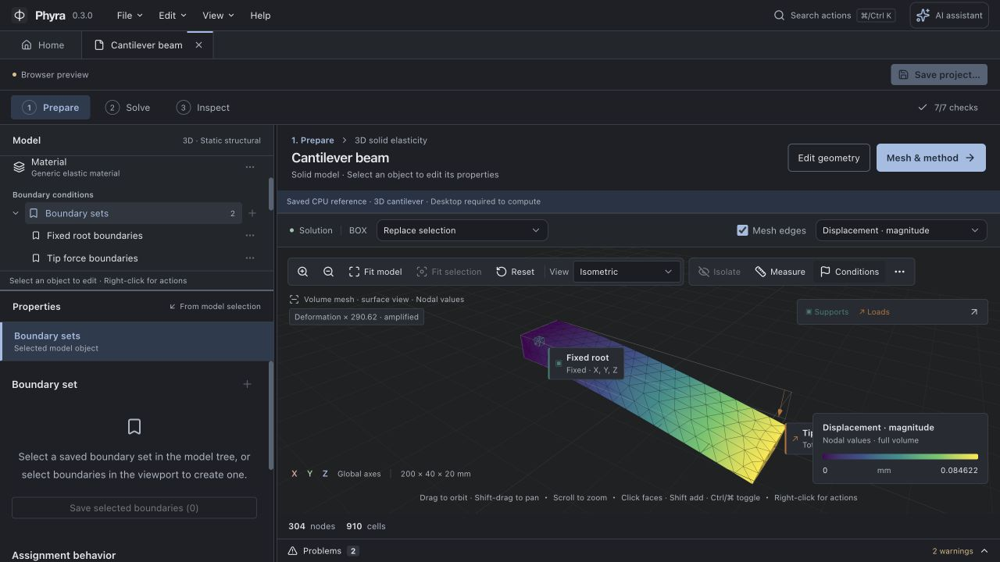
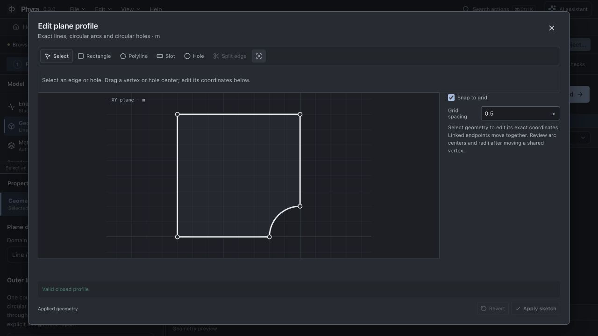
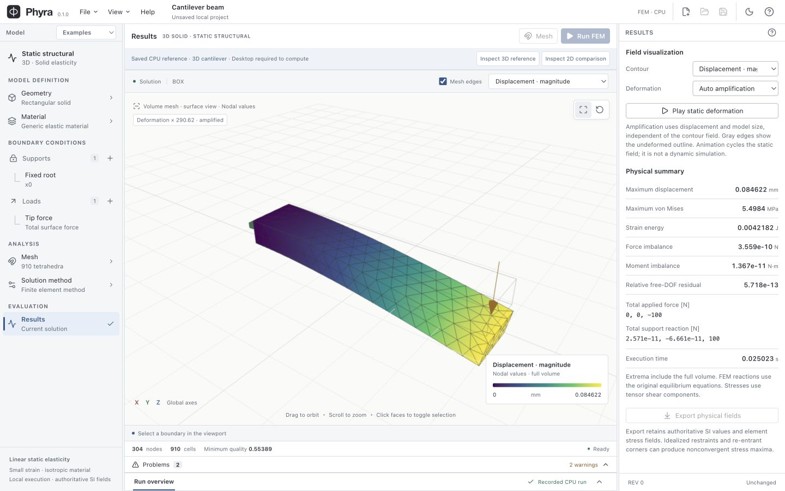
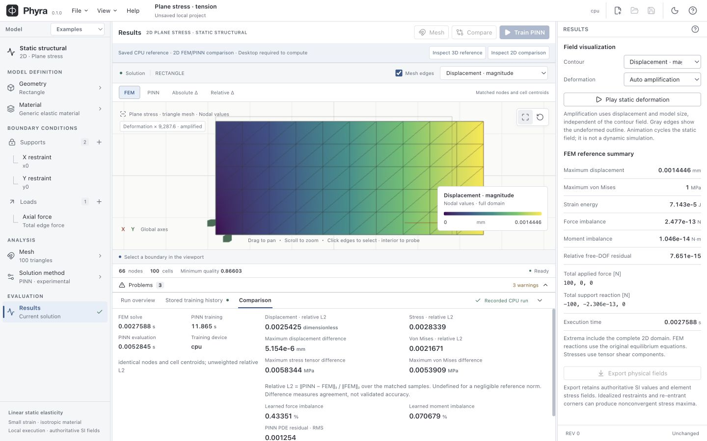

<p align="center">
  <picture>
    <source media="(prefers-color-scheme: dark)" srcset="assets/phyra-wordmark-dark.svg" />
    
  </picture>
</p>

<p align="center"><strong>Prepare a physical problem. Solve locally. Understand the result.</strong></p>

Phyra is an open-source engineering analysis desktop workbench combining classical finite element analysis with experimental Physics ML. **v0.3.0** brings interactive 2D sketch drafting, experimental potential-energy PINNs, independent project tabs and an optional AI assistant to local linear static elasticity workflows.

<p align="center">
  <video src="https://github.com/user-attachments/assets/82392e78-5332-4051-8a2d-bd3ef58a8933" poster="assets/media/phyra-introduction-poster.jpg" controls="controls" playsinline="playsinline" preload="metadata" width="1920" height="1080" aria-label="Phyra v0.3.0 launch video with English narration and captions"></video>
</p>

**Explore:** [source repository](https://github.com/oguzhankir/phyra) · [the roadmap](ROADMAP.md) · [built-in examples](examples) · [offline method guide](#learn-the-implemented-method)

The video and screenshots show the v0.3.0 interface and genuine saved CPU references. The video introduces implemented methods and labels v0.4.0 ideas as planned direction. Deformation display amplifies a static field, not a dynamic simulation. Computing a new solution requires the desktop app.

## What you can do today

- **Prepare and solve:** edit box, cylinder and connected bracket primitives or a 2D rectangle/profile with exact straight edges, circular arcs and circular holes; assign material, component supports, total force, pressure or typed spatial traction; generate a mesh and run classical FEM.
- **Train from physics:** train rectangular strong-form or rectangle/profile potential-energy plane-stress PINNs with real PyTorch/autograd and no FEM training labels. Inspect residual diagnostics, signed energy, independent quadrature audit, device and precision.
- **Compare and inspect:** switch FEM, PINN, absolute and relative differences; probe authoritative values; inspect stress/displacement, reactions and balance. Use standard camera views, fit/reset, boundary isolation and undeformed node/preview-vertex distance measurement.
- **Understand the method:** open offline Workbench help or contextual screen help for workflow, assumptions, physical conditions, mesh quality, interpretation and limitations.
- **Ask with context:** connect your own Gemini, OpenAI, Anthropic, OpenAI-compatible or local Ollama endpoint for documentation/study explanations with source citations and independent saved connections. Optional local MCP provides selectable read-only tools.
- **Keep ownership:** local isolated workers, cancellation, stale-result detection, versioned `.phyra` save/reopen, definition-only recovery copies and SI CSV exports. Analysis needs no account, API key or network service.

Undo/redo preserves up to 80 definition edits within a 16 MiB session budget. Physical undo restores the inputs and requires a new analysis; it cannot reactivate earlier fields. Project names, display units and named-set metadata leave physical results current. Opening or restoring a project starts a fresh edit history.



Preparation tools and copied boundary sets in the current workbench; the new CAD workspace adds constrained sketches, exact feature evaluation and STEP import. The images above show the earlier recorded interface.



Editable line/arc profile in the expanded 2D sketch editor; the circular cutout is an exact outer arc.



Saved CPU 3D FEM reference · amplified static deformation · independent project tabs.



Saved CPU FEM/PINN comparison · matching physical locations · recorded measurements, not live training.

## Run locally

Install Node **22.12+**, Python **3.12**, Rust **1.94** with rustfmt/clippy, Git and CMake **3.18+**. macOS needs Xcode command-line tools; Windows needs Visual Studio C++ Build Tools, Windows SDK and WebView2. On Windows, CMake must support the installed Visual Studio generator; setup discovers an MSVC x64 toolchain and its matching generator. Supported launch targets are macOS Apple Silicon, minimum macOS 14, and Windows x64.

```sh
git clone https://github.com/oguzhankir/phyra.git
cd phyra
npm ci
npm run setup
npm run package:engine
npm run dev
```

`setup` preserves an existing `.venv`, prefers official Python on macOS and installs CPU Torch on Windows. Workers start automatically. [CONTRIBUTING.md](CONTRIBUTING.md) contains verification and packaging commands.

For a browser preview after `npm ci`, run `npm run dev:web` and open the local URL. On **Home**, **3D FEM** and **2D FEM / PINN** load real saved CPU results, including fields, recorded training history and measured comparison. Changes to physical inputs make those results stale.

Phyra opens on **Home**. Choose **New project** to name an empty 2D or 3D geometry document, **Open project…** to reopen a file, or **Cantilever beam** from Example projects for a first desktop study. The project overview opens the CAD workspace and reports exact geometry validity separately from analysis compatibility. A supported design can receive a study. **Prepare** contains the study, geometry, material, supports and loads; **Solve** contains mesh and method settings; **Inspect** contains current fields and physical checks. Right-click objects/boundaries or use their actions buttons to edit or add conditions. For Physics ML, choose **Plate in tension** on Home, inspect thickness and supports, then use **Compare FEM + PINN** in Solution method. **Commands** or **Ctrl/⌘ K** searches available editors and actions. Choose **Help** or press **F1** for the current screen’s offline guide.

In CAD, choose **New sketch**, choose **Closed profile** or **Sweep path**, select XY/XZ/YZ and draw on the blank canvas with Line, Polyline, Rectangle, Circle or 3-point arc. Endpoint/origin/grid snapping connects the authored graph. Select curves or points to add dimensions and geometric constraints; Shift-click adds to selection. Numeric edits commit once on Enter or leaving the field; Escape reverts the entry. **Solve constraints** updates coordinates and reports DOF/conflicts even for an open sketch. **Finish sketch** retains its visible outline; closed profiles can feed Extrude or Revolve. Select a feature once in the tree to inspect it; Edit sketch or a double-click opens drawing. Move / rotate records rigid placement of sketches or bodies; Fillet/Chamfer guide edge selection. Standard views and Fit control the model camera. **Auto rebuild** pauses during sketch editing; **Rebuild geometry** validates the exact output. The Surface & assembly toolbar creates ordered lofts, sweeps and reusable component instances. Duplicate as placed section creates an editable second cross-section; component Move / rotate splits shared placement when needed and preserves the assembly output. Loft/sweep accept no-hole profiles and offer solid or surface output; a sweep uses a connected open line/arc path and an explicitly placed perpendicular section at its first-created endpoint. Bodies can be selected and isolated without changing the model. Unsupported analysis remains clearly gated while the CAD definition stays editable and exportable.

Projects open in independent tabs, with up to 32 documents in a session. Each owns its definition, edit history, file association, recovery and result publication. Switching tabs preserves that state. The first **Save project…** chooses a `.phyra` file location; enabled **Auto-save** then writes validated changes after a 1.5-second pause. A successful save briefly confirms completion. Close a saved project directly, or use **Save / Discard / Cancel** for unsaved changes. Draft recovery remains separate from the project file.

The preparation checklist reviews seven categories before running: study, geometry, material, supports, loads, mesh settings and method eligibility. Its rigid-motion check considers the selected boundary components; the meshed worker performs the authoritative restraint-rank and scientific checks. In 2D Geometry, draft rectangles, polylines, exact rounded slots and holes; split straight edges at their midpoint on the bounded sketch canvas, convert selected edges to circular arcs, use grid snapping and radius edits, then **Apply sketch** or **Revert**. This legacy profile editor remains available for numerical examples; the dedicated CAD workspace adds authored constraints and exact feature history.

Open **AI assistant** with the assistant icon or **Ctrl/⌘ J**. **Connections** manages Gemini, OpenAI, Anthropic, OpenAI-compatible and local Ollama connections independently. Paste a remote key and connect once; keys stay in native OS storage, scoped by provider and endpoint origin. The composer model selector lists account-discovered models from every connected provider. Connecting another provider preserves the model chosen for your chat. Sending a question authorizes its selected provider to receive relevant offline help, the active project snapshot and bounded recent conversation turns, without a repeated sharing dialog. CAD-only projects include authored geometry and bounded current exact-evaluation/sketch-solve evidence: feature identity, SI measurements, DOF/conflicts and the analysis-compatibility reason. Oversized definitions are explicitly marked summaries. Start a new chat to exclude earlier project discussion. No local files, screenshots or bulk field buffers are automatically attached. Text streaming uses Gemini `streamGenerateContent`, OpenAI Responses, Anthropic Messages and compatible Chat Completions. Account discovery does not establish every listed model's capabilities; pricing is unknown and your provider controls API charges.

Assistant transcripts use separate local version 1 storage, bounded to 160 messages/2 MiB per conversation, 100 conversations and 32 MiB total. Each answer retains its provider/model/endpoint and supplied context, so earlier explanations can be checked against their original project revision. They do not update when inputs change or certify a physical conclusion. The assistant cannot edit, solve, export or browse. **Integrations → Local MCP** offers independent capability, help, project/CAD-definition and result-summary tools. CAD evidence is available only under the project tool permission. **Start MCP** enables local stdio access with protocol `2025-11-25`; **Open in VS Code** opens its official server installation flow, while **Copy configuration** supports VS Code and Claude-compatible formats. The terminal access log records allowed and denied requests. Tool changes invalidate older client sessions; reconnect with the updated configuration. **Stop MCP**, session release or 90 seconds without refresh revokes access. No mutating agent tools are implemented.

## Scientific scope

The implemented physics is homogeneous, isotropic, small-strain **linear static elasticity**. 3D uses first-order tetrahedra; 2D plane stress uses first-order triangles assembled through [scikit-fem](https://scikit-fem.readthedocs.io/en/latest/api.html), with explicit physical thickness. Profiles contain one closed counterclockwise outer loop of up to 64 straight edges/circular arcs (each at most 180°) and up to 16 enclosed circles. Gmsh receives exact curves; the linear FEM mesh represents curved boundaries with chords. Internal geometry, properties and exports use SI; display-unit changes do not modify the model.

Choose **Plate with a hole** on Home for the editable second-quadrant plate with a circular cutout, symmetry supports and the exact spatial outer traction σn. Its setup is checked against Section 6.3 and Appendix B.2 of [Le-Duc, Nguyen-Xuan and Lee (2026)](https://doi.org/10.1016/j.finel.2026.104523) and the [linked author implementation at `0889268`](https://github.com/ThangLe-duc/nEPINN/blob/0889268fbb3cb5cbbf92b4b9c7cf2c90f79fad75/Elasticity_2Dand3D/PlateWithHole.py). The author's code uses the second quadrant; the appendix describes the mirrored first quadrant. The numerical defaults are R = 1, L = 4, E = 100000, ν = 0.3 and remote X tension = 0.5. **Neither source states units or physical thickness:** Phyra authors an SI realization in m/Pa with a chosen 0.1 m thickness. This FEM workflow does not reproduce nEPINN training or its performance claims.

The eligible quarter-plate result reports independently evaluated Kirsch displacement/stress errors at identical triangle quadrature locations, area-weighted relative L2 norms and free-hole traction diagnostics. A zero reference norm makes the relative metric undefined. Change the arc radius in Geometry, then update the traction radius/tension in Loads; retain symmetry and outer assignments to keep the analytical comparison applicable. Vary mesh and boundary sizes, solve again and assess overall convergence. General line/arc profiles and circular holes use the same editor, mesher, solver, save/reopen and SI export path; arbitrary edits may remove the analytical reference. Strong-form training remains limited to rectangular force/pressure studies. Potential-energy training supports rectangle/profile force, pressure and typed traction, with compatible constant displacement components on finite straight exterior segments; curved essential boundaries and conflicting intersections are rejected.

The PINN is **experimental**. Comparison evaluates displacement at the same nodes and stress at the same cell centroids as FEM, reporting unweighted relative L2, maximum absolute differences and measured timings. Undefined zero-reference relative values are explicitly omitted. New runs also measure normalized residuals at independently sampled points after training; those diagnostics are not field-error bounds. Low training loss alone does not establish accuracy or equilibrium; use independent references, balance and mesh convergence.

Idealized corners/restraints may produce stress singularities, and first-order tetrahedra can be stiff in bending. Poisson ratios above 0.45 are rejected. Deformation playback scales a static field; it is not dynamics. Distance measurement uses undeformed mesh nodes or preview vertices, not exact CAD edge/face distances. Projects retain settings, seeds, metrics, fields and provenance, but do not resume trained weights. Profile boundary IDs persist through remeshing; deleted or renamed IDs leave assignments invalid until explicitly repaired.

Project schema version 7 stores empty design documents or exact CAD feature recipes with an optional study. STEP definition sources are bounded, content addressed and included in .phyra archives. The version retains explicit strong-form/potential-energy configuration, typed traction and up to 100 named boundary sets. Sets retain their geometry/dimension stamp for explicit repair and copy into assignments; they are not associative CAD references. Versions 1–6 are validated against frozen schemas before migration. Versions through 4 receive strong-form; version 5 preserves its selected formulation. Unchanged v4 fields preserve their physical fingerprints. Version 1 caches are discarded; older primitive-study caches pass the normal worker ownership, fingerprint and field checks before reuse. New profile and traction inputs receive a distinct physical fingerprint.

Desktop recovery preserves valid project definitions after an editing pause; invalid numeric drafts pause recovery. Older valid journals migrate in memory while their original bytes remain intact. Restoring creates an unsaved project without cached fields or trained weights. Recompute and save it explicitly; recovery does not overwrite the original project file.

Assembly mates/contact, unrestricted imported-solid analysis, freeform surface editing and shell/thicken, multiple materials, anisotropy/composites/graded and nonlinear materials, transient physics, thermal/flow solvers, reusable learned models and assistant-driven model/solver actions are future work. The [roadmap](ROADMAP.md) sets their dependencies and scientific acceptance gates, including optional framework adapters and a future CPU/Apple/NVIDIA/distributed execution runtime. No external Physics ML framework or distributed runtime is integrated today.

New projects start as empty 2D/3D designs on a project overview. Open **Geometry** for the large CAD workspace; author line/arc/circle sketches with explicit constraints, box/cylinder features, extrusion, revolution, Boolean operations, fillets and chamfers, loft/sweep solids or surfaces, and separately placed assembly instances, or import STEP. **Evaluate geometry** uses local OpenCASCADE and the pinned SolveSpace C ABI, reporting sketch degrees of freedom, conflicting constraints, invalid operations and ambiguous topology. Exact SI BRep and m/mm STEP exports use the evaluated shape, independently of solver support.

Geometry validity and study eligibility are separate. Current analysis adapters cover direct boxes, X-axis cylinders, XY profiles and positive origin-aligned rectangular XY extrusion. Supported designs proceed to material, supports/loads, mesh/method and results; general STEP, revolution, Boolean, edge-treatment, loft/sweep and assembly outputs remain editable designs with a visible analysis gate. Editing geometry preserves the recipe and invalidates incompatible assignments/results. Topology references identify unchanged entities; ambiguous or changed selections require repair rather than an automatic reassignment.

## Learn the implemented method

Start with **Plate in tension** on Home: review units and restraints, run FEM, then run **Compare FEM / PINN**. Inspect field differences, reactions and balance alongside training losses. The offline **Physics ML learning path** explains the steps and links the primary references.

The current PINN uses a neural displacement field and automatic differentiation to evaluate equilibrium and boundary residuals, adapted from [Raissi, Perdikaris and Karniadakis (2019)](https://doi.org/10.1016/j.jcp.2018.10.045). It learns one problem without FEM training labels. The experimental potential-energy formulation adapts energy and exact-displacement ideas from [Wang et al. (2023)](https://doi.org/10.1016/j.cma.2023.116184). It minimizes integrated strain energy minus external work and reports a separate finer-quadrature audit; a discrepancy above 1% rejects publication. This audit is not a field-accuracy certificate. [FNO](https://arxiv.org/abs/2010.08895) reusable operator learning remains future work. The papers do not establish Phyra accuracy or speedup. **Eccentric displacement** on Home follows the partial-top-edge boundary pattern of Wang Section 3.2 as a small-strain adaptation; the original used large displacement and a different architecture/runtime. The source and all SI/thickness choices are disclosed in offline help. **Energy · plate in tension** and **Energy · circular cutout** reuse the same method path. [Research case metadata](examples/research-cases.json) records sources, deviations, seeds, reference/error policies and failures; `npm run verify:research -- [case-id]` writes actual CPU compare/cache/audit evidence under ignored `artifacts/research/`. High residual or balance errors remain visible even when the quadrature audit passes.

## Validation and direction

Independent analytical/manufactured references live in [engine tests](engine/tests); typed scientific/project tests live beside [domain logic](src/domain), with interface tests beside [frontend features](src/features); [native tests](src-tauri/src/tests) cover safe files and worker lifecycle.

**Prior platform baseline:** [scientific and packaged verification at `3498f34`](https://github.com/oguzhankir/phyra/actions/runs/36761517423) passed on macOS 15 Apple Silicon and Windows Server 2022 x64. It covers that earlier snapshot's FEM/PINN rendering, persistence, cancellation and recovery; it does not verify this PR's later profile, architecture or interface changes. Representative-user usability remains open.

Minimum macOS 14 execution and manual consumer installation, native dialogs and uninstall remain open. macOS development packages use ad hoc or explicitly configured local signing; Developer ID signing/notarization and production distribution trust remain unfinished on both targets. Source releases and local build instructions are available; public installers require the redistribution work below.

Phyra's direction is capable engineering preparation combined with validated Physics ML: CAD/sketching and richer physical conditions; thermal/fluid and coupled families; inverse problems, reusable operators, uncertainty and controlled engineering assistance. Contributions should deliver complete, reproducible workflows rather than placeholder modules. See [the roadmap](ROADMAP.md), the [contribution guide](CONTRIBUTING.md) and its [implementation ownership and extension guide](CONTRIBUTING.md#finding-and-extending-the-implementation). Automated dependency checks enforce those boundaries.

Built with Tauri 2, React, TypeScript, Three.js, Gmsh, scikit-fem, SciPy and PyTorch. Licensed [GPL-3.0-or-later](LICENSE); required upstream notices and target-specific dependency/Corresponding Source obligations are in [notices/THIRD_PARTY.txt](notices/THIRD_PARTY.txt). Optional provider marks retain their [upstream MIT license](public/providers/LICENSE) and [provenance notice](public/providers/NOTICE); their use does not imply endorsement.

## Citation

If you use Phyra in research, cite **Kır, Oğuzhan. Phyra [Computer software]**, [repository](https://github.com/oguzhankir/phyra). [CITATION.cff](CITATION.cff) provides machine-readable metadata. Record the exact code revision and study settings in your methods; a versioned archival DOI and release date will be added only after an actual release.

For vulnerability reporting and current security-support limits, see [SECURITY.md](SECURITY.md).
